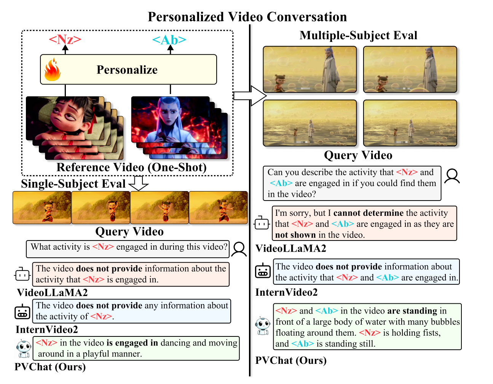

# PVChat: Personalized Video Chat with One-Shot Learning

<p align="center">
  <span style="color: red; font-size: 2.2em; font-weight: bold;">ICCV 2025</span>
</p>

---

<p align="center">
  <a href="https://arxiv.org/abs/2503.17069">
    
  </a>
  <a href="https://huggingface.co/papers/2503.17069">
    
  </a>
</p>

---

<p align="center">
  
</p>

---

This repository contains the implementation of PVChat, a personalized video chat model that extends InternVideo2 with person-specific fine-tuning capabilities.

## To-Do List

- [x] Dataset Expansion
- [x] Dataset Organization
- [x] Dataset Expansion Code Optimization
- [ ] Fine-tuning Code Optimization
- [ ] HuggingFace Weights Update
- [ ] Two people training process
- [ ] three people training process
## Table of Contents
- [1. Dataset Expansion](#1-dataset-expansion)
  - [1.1 Environment Setup](#11-environment-setup)
  - [1.2 Code Configuration](#12-code-configuration)
  - [1.3 CelebV-HQ Dataset](#13-celebv-hq-dataset)
  - [1.4 InternVideo2 Weights](#14-internvideo2-weights)
  - [1.5 Dataset Expansion Commands](#15-dataset-expansion-commands)
- [2. Fine-tuning Process](#2-fine-tuning-process)

## 1. Dataset Expansion

### 1.1 Environment Setup

This project requires 7 different conda environments for various components. All environment requirement files are located in the `environment/` folder.

Create and configure each environment using the following commands:

#### 1. ConsisID Environment
```bash
conda create -n consisid python=3.11.0
conda activate consisid
pip install -r environment/requirements_consisid_python_3.11.0.txt
```

#### 2. DeepFaceLab Environment
```bash
conda create -n deepfacelab python=3.7.16
conda activate deepfacelab
pip install -r environment/requirements_deepfacelab_python_3.7.16.txt
```

#### 3. Face Quality Environment
```bash
conda create -n face_quality python=3.8.20
conda activate face_quality
pip install -r environment/requirements_face_quality_python_3.8.20.txt
```

#### 4. LivePortrait Environment
```bash
conda create -n LivePortrait python=3.10.6
conda activate LivePortrait
pip install -r environment/requirements_LivePortrait_python_3.10.6.txt
```

#### 5. PhotoMaker Environment
```bash
conda create -n photomaker python=3.10.6
conda activate photomaker
pip install -r environment/requirements_photomaker_python_3.10.6.txt
```

#### 6. PVChat Environment
```bash
conda create -n pvchat python=3.10.0
conda activate pvchat
pip install -r environment/requirements_pvchat_python_3.10.0.txt
```

#### 7. Qwen Environment
```bash
conda create -n qwen python=3.10.0
conda activate qwen
pip install -r environment/requirements_qwen_python_3.10.0.txt
```

#### 8. Download our datasets
```bash
gdown https://drive.google.com/file/d/1pr-oegxyhtLEr6Z0euEa3v4aGvm79UUZ/view?usp=sharing
```

### 1.2 Code Configuration

Clone and configure the following repositories:

#### ConsisID
```bash
git clone https://github.com/PKU-YuanGroup/ConsisID.git ConsisID_temp
```

#### LivePortrait
```bash
git clone https://github.com/KwaiVGI/LivePortrait.git LivePortrait_temp
```

#### DeepFaceLab
```bash
git clone https://github.com/iperov/DeepFaceLab.git DeepFaceLab_temp
```

After cloning and configuring each repository (including downloading required weights from HuggingFace), merge the provided code:

```bash
# For ConsisID
cp -rf consisid/* ConsisID_temp/
# Move the merged folder to the appropriate location if needed

# For LivePortrait
cp -rf LivePortrait/* LivePortrait_temp/
# Move the merged folder to the appropriate location if needed

# For DeepFaceLab
cp -rf Deepfacelab/* DeepFaceLab_temp/
# Move the merged folder to the appropriate location if needed
```

**Note**: The `cp -rf` command will overwrite files with the same name and copy new files that don't exist in the destination.

### 1.3 CelebV-HQ Dataset

Download the CelebV-HQ dataset following the instructions from the official repository:

1. Visit: https://github.com/CelebV-HQ/CelebV-HQ
2. Follow the download instructions provided in the repository
3. Place the downloaded dataset in:
   ```
   datasets/celebv-hq/
   ```

### 1.4 InternVideo2 Weights

1. Download the original InternVideo2 weights and place them in:
   ```
   PVChat/InternVideo2/multi_modality/Internvideo2_chat_8B_HD_finetune_REMOH/
   ```

2. Merge the PVChat modifications:
   ```bash
   # Copy and overwrite existing files, add new files
   cp -rf PVChat/InternVideo2/multi_modality/Internvideo2_chat_8B_HD_PVChat/* \
          PVChat/InternVideo2/multi_modality/Internvideo2_chat_8B_HD_finetune_REMOH/
   ```

### 1.5 Dataset Expansion Commands

To expand your dataset with person-specific videos:

1. Place your source video files in:
   ```
   Deepfacelab/data_src/
   ```

2. Update the paths in the script:
   ```bash
   # Edit the script to update paths to your local directory
   vim PVChat/InternVideo2/multi_modality/all_dataset_set_detail.sh
   ```

3. Run the dataset expansion script:
   ```bash
   cd PVChat/InternVideo2/multi_modality/
   bash all_dataset_set_detail.sh
   ```

## 2. Fine-tuning Process

### Configuration

1. **Update the training script parameters:**
   
   Edit `PVChat/InternVideo2/multi_modality/finetune_internvideo_REOMH_one_person2_stage.py` with the following parameters:
   
   - `--sks_name`: Name of the target person (e.g., "john_doe")
   - `--model_path`: Path to the model checkpoint
   - `--train_json`: Path to training JSON file generated from dataset expansion
   - `--short_train_json`: Path to short training JSON file
   - `--test_json`: Path to test JSON file

2. **Update the configuration file:**
   
   Edit `PVChat/InternVideo2/multi_modality/Internvideo2_chat_8B_HD_finetune_PVChat/config.json`:
   
   ```json
   {
     ...
     "sks_name": "your_person_name",
     ...
    "model_config": {,
     "sks_name": "your_person_name",
     ...}
   }
   ```
   
   **Note**: There are two instances of `sks_name` in the config file. Both must be updated with the same person name.

### Training

Run the fine-tuning script:

```bash
cd PVChat/InternVideo2/multi_modality/
python finetune_internvideo_REOMH_one_person2_stage.py \
    --sks_name "your_person_name" \
    --model_path "path/to/model" \
    --train_json "path/to/train.json" \
    --short_train_json "path/to/short_train.json" \
    --test_json "path/to/test.json"
```

## Project Structure

```
PVChat/
├── PVChat/
│   ├── InternVideo2/
│   │   └── multi_modality/
│   │       ├── Internvideo2_chat_8B_HD_finetune_REMOH/
│   │       ├── Internvideo2_chat_8B_HD_PVChat/
│   │       ├── Internvideo2_chat_8B_HD_finetune_PVChat/
│   │       ├── all_dataset_set_detail.sh
│   │       └── finetune_internvideo_REOMH_one_person2_stage.py
│   ├── consisid/
│   ├── LivePortrait/
│   └── Deepfacelab/
│       └── data_src/
├── datasets/
│   └── celebv-hq/
├── environment/
│   ├── requirements_consisid_python_3.11.0.txt
│   ├── requirements_deepfacelab_python_3.7.16.txt
│   ├── requirements_face_quality_python_3.8.20.txt
│   ├── requirements_LivePortrait_python_3.10.6.txt
│   ├── requirements_photomaker_python_3.10.6.txt
│   ├── requirements_pvchat_python_3.10.0.txt
│   └── requirements_qwen_python_3.10.0.txt
└── README.md
```

## Requirements

- CUDA-compatible GPU with sufficient VRAM (recommended: 48GB+)
- Conda package manager
- Git
- Sufficient disk space for datasets and model weights

## Citation

If you find our paper and/or code helpful, please consider citing :
```
@misc{shi2025pvchatpersonalizedvideochat,
      title={PVChat: Personalized Video Chat with One-Shot Learning}, 
      author={Yufei Shi and Weilong Yan and Gang Xu and Yumeng Li and Yuchen Chen and Zhenxi Li and Fei Richard Yu and Ming Li and Si Yong Yeo},
      year={2025},
      eprint={2503.17069},
      archivePrefix={arXiv},
      primaryClass={cs.CV},
      url={https://arxiv.org/abs/2503.17069}, 
}
```
## License

Please refer to the individual licenses of the incorporated projects.