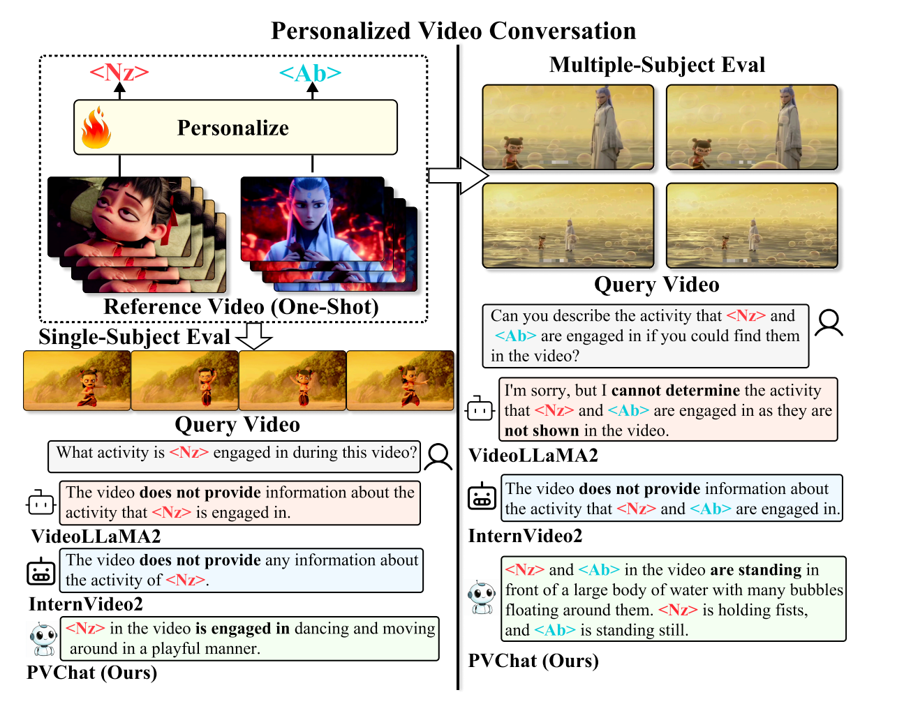

# PVChat-R1: Personalized Video Chat with Reinforcement Learning

<p align="center">
  <a href="https://arxiv.org/abs/2503.17069">
    
  </a>
  <a href="https://huggingface.co/papers/2503.17069">
    
  </a>
</p>

<p align="center">
  
</p>

PVChat-R1 extends [PVChat (ICCV 2025)](https://arxiv.org/abs/2503.17069) — a personalized video chat
model that learns a new person from one video — with a third, reinforcement-learning stage.
The repository contains everything needed to reproduce training:

| Stage | What it trains | Data | Qwen3.5-9B backbone | InternVideo2 backbone |
|---|---|---|---|---|
| 1 | Person tokens + ReMoH on short clips (4 frames) | `<P>_short_train.json` | `finetune_qwen35_pvchat_stage1.py` | `finetune_internvideo_REOMH_one_person2_stage.py` |
| 2 | Same parameters on full videos, 5 QA categories | `<P>.json` | `finetune_qwen35_pvchat_stage2.py` | (same script, second stage) |
| 3 | RL from the Stage 2 checkpoint | `<P>.json` | **CA-Dynamic-GSPO**: `finetune_qwen35_pvchat_stage3_ca_dynamic_gspo_buffered.py` | GRPO: `run_internvideo2_stage3.sh` |

Stage 3 (CA-Dynamic-GSPO, *Constraint-Anchored Dynamic Group Sequence Policy Optimization*) samples
2 → 4 → 8 candidate answers per question on demand, ranks them lexicographically by validity,
identity consistency and content quality, anchors every update with a small supervised term on the
gold answer, and updates the policy with a buffered, clipped GSPO objective. Only the personalized
parameters (person tokens, LoRA, ReMoH routers) are ever trained; the base vision tower and language
model stay frozen, so a checkpoint is a few hundred MB on top of the public base weights.

The dataset-expansion pipeline of the original PVChat release (Section 6) is kept unchanged except
that video QA is now generated with Qwen3-VL and includes an `emotion` category.

## Table of Contents
- [1. Repository Layout](#1-repository-layout)
- [2. Environments](#2-environments)
- [3. Data](#3-data)
- [4. Qwen3.5-9B Backbone: Stage 1 → 2 → 3](#4-qwen35-9b-backbone-stage-1--2--3)
- [5. InternVideo2 Backbone: Stage 1/2 and Stage 3](#5-internvideo2-backbone-stage-12-and-stage-3)
- [6. Dataset Expansion](#6-dataset-expansion)
- [7. Evaluation Metrics](#7-evaluation-metrics)
- [Citation](#citation)

## 1. Repository Layout

```
PVChat-R1/
├── README.md
├── requirements_qwen35.txt                  # pip entrypoint for the Qwen3.5 environment
├── environment/                             # requirement files of the dataset-expansion tools
├── build_index.py, clip-retrieval.py        # LAION face retrieval (dataset expansion)
├── consisid/, Deepfacelab/, LivePortrait/   # patches merged into the third-party repos (dataset expansion)
└── PVChat/InternVideo2/multi_modality/
    ├── qwen35_pvchat/                       # Qwen3.5 PVChat package (model, data, ReMoH, rewards, Stage 3 engine)
    ├── finetune_qwen35_pvchat_stage1.py     # Qwen3.5 Stage 1
    ├── finetune_qwen35_pvchat_stage2.py     # Qwen3.5 Stage 2
    ├── finetune_qwen35_pvchat_stage3_ca_dynamic_gspo_buffered.py   # Qwen3.5 Stage 3 (CA-Dynamic-GSPO)
    ├── run_qwen35_pvchat_all.sh             # Stage 1 -> 2 -> 3 for one person
    ├── run_qwen35_stage3_ca_dynamic_gspo.sh # Stage 3 only, final hyper-parameters
    ├── setup_qwen35_h200.sh                 # pinned Qwen3.5 environment (Python 3.11, CUDA 12.6)
    ├── requirements_qwen35_h200.txt, patches/
    ├── Internvideo2_chat_8B_HD_finetune_REMOH/   # InternVideo2 + ReMoH model code (weights downloaded separately)
    ├── finetune_internvideo_REOMH_one_person2_stage.py   # InternVideo2 Stage 1 + 2
    ├── generate_grpo_rollouts.py            # InternVideo2 Stage 3: rollouts
    ├── finetune_internvideo_REOMH_one_person3_grpo.py    # InternVideo2 Stage 3: GRPO
    ├── run_pvchat_checkpoint_test.py        # InternVideo2: test-set decoding
    ├── internvideo_compact_checkpoint.py    # compact (delta-only) InternVideo2 checkpoints
    ├── run_internvideo2_stage3.sh           # InternVideo2 Stage 3 end-to-end
    ├── evaluate_pvchat_metrics.py           # Acc / BLEU-1 / BERTScore / ES / DC
    ├── pvchat_dataset_validation.py
    ├── all_dataset_set_detail.sh, video_qa_generation_all_video*.py, short_video_generation*.py, ...  # dataset expansion
    └── tests/                               # unit tests (CPU only)
```

Base weights, the patched Transformers checkout, datasets, judge weights and run outputs are
ignored by Git and live next to the code:

```
PVChat-R1/Qwen3.5-9B/               # hf download Qwen/Qwen3.5-9B
PVChat-R1/models/Qwen3.5-35B-A3B/   # local judge for ES/DC (hf download Qwen/Qwen3.5-35B-A3B)
PVChat-R1/transformers-qwen35/      # pinned Transformers checkout created by setup_qwen35_h200.sh
PVChat-R1/PVChat/datasets/cekebv-hq/<Person>/   # data (Section 3)
```

## 2. Environments

### 2.1 Qwen3.5-9B stack (Stage 1/2/3 and metrics)

`setup_qwen35_h200.sh` creates the pinned environment we trained with: Python 3.11, PyTorch 2.7.1
(cu126), TorchCodec 0.5.0, Transformers at commit `63f32a87` plus a small TorchCodec-compatibility
patch (`patches/`), causal-conv1d 1.6.2.post1 and flash-linear-attention 0.5.1 for the Qwen3.5 fast
path, and it downloads `Qwen/Qwen3.5-9B` into `Qwen3.5-9B/`.

```bash
cd PVChat/InternVideo2/multi_modality
bash setup_qwen35_h200.sh            # env: conda envs/pvchat-qwen35-h200
# optional overrides: QWEN_ENV_NAME, PYTHON_VERSION, TORCH_INDEX_URL, INSTALL_FAST_KERNELS=0, DOWNLOAD_MODEL=0
```

Every Qwen3.5 command below assumes

```bash
conda activate pvchat-qwen35-h200
export PYTHONPATH=$PWD/transformers-qwen35/src:$PWD/PVChat/InternVideo2/multi_modality   # from the repo root
```

TorchCodec loads FFmpeg (4–7) and CUDA NPP shared libraries at runtime. If they are not on the
system library path, set `FFMPEG_LIB_DIR=/path/to/ffmpeg/lib`; the launch scripts then prepend it
and the pip-installed NPP libraries to `LD_LIBRARY_PATH`.

ES and DC (Section 7) are scored by a local judge, `Qwen/Qwen3.5-35B-A3B`, downloaded to
`models/Qwen3.5-35B-A3B/`. It needs roughly 70 GB of GPU memory and is loaded on `cuda:0` after
training; keep one Stage 3 run per 80 GB-class GPU, or pass `--judge_backend dashscope`
(`DASHSCOPE_API_KEY`) or `--skip_metrics`.

### 2.2 InternVideo2 stack

The InternVideo2 backbone uses the original PVChat environment
(`environment/requirements_pvchat_python_3.10.0.txt`, Transformers 4.38). Download the
InternVideo2 weights as in Section 6.4; the ReMoH model code in
`Internvideo2_chat_8B_HD_finetune_REMOH/` is loaded with `trust_remote_code`. The metric step of
the InternVideo2 pipeline runs `evaluate_pvchat_metrics.py` in the Qwen3.5 environment.

## 3. Data

Per-person data lives in `PVChat/datasets/cekebv-hq/<Person>/`:

```
<Person>_short_train.json   # Stage 1: short clips, identity + clothing QA
<Person>.json               # Stage 2 / Stage 3: full videos, 5 QA categories
<Person>test.json           # test set used after every stage
videos/...                  # referenced by video_path (relative to the JSON or its parent directory)
```

All three files share one schema. `is_positive` marks whether the person appears in the video,
`is_special` marks the identity-presence questions used for accuracy:

```json
{
  "videos": [
    {
      "video_name": "Sheldon2.mp4",
      "video_path": "../../videos/video_000015.mp4",
      "sks_present": "<Sheldon>",
      "gender": "male", "age": "adult",
      "is_positive": true,
      "qa_pairs": [
        {"question": "Does <Sheldon> appear at all?", "answer": "<Sheldon> is clearly visible.", "is_special": true},
        {"question": "What is <Sheldon> wearing?", "answer": "...", "is_special": false}
      ]
    }
  ]
}
```

Training JSONs must contain both positive and negative videos (`pvchat_dataset_validation.py`
checks this before training). The expanded datasets and the Stage 2 checkpoints used in the paper
will be released on Hugging Face: **<link to be added>**. To build data for a new person, follow
Section 6.

## 4. Qwen3.5-9B Backbone: Stage 1 → 2 → 3

### 4.1 What is trained

The base Qwen3.5-9B (vision tower and language model) stays frozen. Trainable parameters:

1. the input-embedding and `lm_head` rows of the person token `<P>` and 16 detail tokens
   `<sks_token1>` … `<sks_token16>` (`--num_detail_tokens 16`);
2. LoRA (r = 16, α = 32) on the language-model linear layers (`qwen35_pvchat/personalization.py`,
   no PEFT dependency);
3. ReMoH (Re-weighted Mixture-of-Heads) routers and head scales in attention layers `7,11,15,19`
   with routed heads `3,7,11,15` (`--remoh_layers`, `--routed_heads`). At initialisation the routed
   attention equals the pretrained attention, so training starts from the base model exactly.

Checkpoints (`pvchat_trainable.pt` + `pvchat_config.json` + processor) store only these tensors
and always require the original `Qwen3.5-9B/` directory when loaded.

Videos are sampled at 2 fps (4–768 frames). The visual budget defaults to 768 pixel blocks of
32×32 per video (`--video_max_tokens 768`). For long videos use a per-video budget instead:
`--video_budget_per_10_seconds 768` gives every video `768 × ceil(seconds / 10)` blocks (10 s → 768,
60 s → 4608, 180 s → 13824) and is accepted by all three stages.

### 4.2 One command for all three stages

```bash
cd PVChat/InternVideo2/multi_modality
GPU_IDS=0 PERSON_NAME=Sheldon STAGE2_EPOCHS=3 bash run_qwen35_pvchat_all.sh
# DATA_DIR / MODEL_PATH / OUTPUT_ROOT / PYTHON_BIN / JUDGE_BACKEND / VIDEO_BUDGET_PER_10S can be overridden
```

Outputs go to `PVChat/datasets/cekebv-hq/<Person>/qwen35_outputs/`:

```
qwen35_outputs/
├── stage1/{checkpoint, evaluation/test_results.json, metrics/metrics_summary.json}
├── stage2/{checkpoint, evaluation/test_results.json, metrics/metrics_summary.json}
└── stage3_ca_dynamic_gspo/
    ├── experiment_manifest.json        # frozen arguments + data fingerprints (resume guard)
    ├── checkpoints/epoch_1
    ├── rollouts/epoch_1                # every sampled group, its rewards and update decision
    ├── evaluations/epoch_1/test_results.json
    └── metrics/epoch_1/{metrics_summary.json, metrics_by_category.json, metrics_details.jsonl}
```

### 4.3 Stage 1 — short clips

```bash
CUDA_VISIBLE_DEVICES=0 python -m torch.distributed.run --standalone --nproc_per_node 1 \
  finetune_qwen35_pvchat_stage1.py \
  --model_path ../../../Qwen3.5-9B \
  --sks_name '<Sheldon>' \
  --train_json '../../datasets/cekebv-hq/Sheldon/<Sheldon>_short_train.json' \
  --test_json  '../../datasets/cekebv-hq/Sheldon/<Sheldon>test.json' \
  --output_dir ../../datasets/cekebv-hq/Sheldon/qwen35_outputs/stage1 \
  --num_epochs 1 --batch_size 1 --video_min_tokens 4 --video_max_tokens 768
```

Stage 1 reads a fixed 4 frames from the first-frame-replicated short clips. Use more GPUs by
raising `--nproc_per_node` and listing them in `CUDA_VISIBLE_DEVICES` (DDP).

### 4.4 Stage 2 — full videos

```bash
CUDA_VISIBLE_DEVICES=0 python -m torch.distributed.run --standalone --nproc_per_node 1 \
  finetune_qwen35_pvchat_stage2.py \
  --model_path ../../../Qwen3.5-9B \
  --checkpoint_path ../../datasets/cekebv-hq/Sheldon/qwen35_outputs/stage1/checkpoint \
  --sks_name '<Sheldon>' \
  --train_json '../../datasets/cekebv-hq/Sheldon/<Sheldon>.json' \
  --test_json  '../../datasets/cekebv-hq/Sheldon/<Sheldon>test.json' \
  --output_dir ../../datasets/cekebv-hq/Sheldon/qwen35_outputs/stage2 \
  --num_epochs 3 --batch_size 1 --video_min_tokens 4 --video_max_tokens 768
```

Useful flags: `--resume_optimizer --epoch_offset N` continues a finished run with its AdamW state;
`--eval_only --checkpoint_path <ckpt>` only decodes the test set and computes metrics (this is the
SFT reference row in our tables); `--skip_evaluation` / `--skip_metrics` for smoke tests.

### 4.5 Stage 3 — CA-Dynamic-GSPO

```bash
CUDA_VISIBLE_DEVICES=0 PERSON=Sheldon bash run_qwen35_stage3_ca_dynamic_gspo.sh
# STAGE2_CKPT / DATA_DIR / OUTPUT_DIR / VIDEO_BUDGET_PER_10S / EXTRA_ARGS can be overridden;
# DISABLE_GRADIENT_CHECKPOINTING=0 recomputes activations to fit 48 GB GPUs
```

which runs, with the hyper-parameters used for all results in the paper:

```bash
python -m torch.distributed.run --standalone --nproc_per_node 1 \
  finetune_qwen35_pvchat_stage3_ca_dynamic_gspo_buffered.py \
  --model_path ../../../Qwen3.5-9B \
  --checkpoint_path <stage2>/checkpoint \
  --sks_name '<Sheldon>' --train_json '<Sheldon>.json' --test_json '<Sheldon>test.json' \
  --output_dir <out>/stage3_ca_dynamic_gspo \
  --num_epochs 1 --max_steps_per_epoch 0 \
  --num_samples 4 --max_new_tokens 96 --temperature 0.5 --top_p 0.9 --top_k 50 \
  --negative_group_weight 2.0 \
  --clip_range 0.2 --drift_beta 0.02 --ref_kl_beta 0.0 --rollout_buffer_size 4 \
  --ca_semantic_threshold 0.60 --ca_informative_margin 0.10 \
  --ca_sft_weight 0.05 --ca_fallback_sft_weight 0.20 \
  --advantage_eps 1e-6 --seed 42 \
  --token_lr 5e-5 --remoh_lr 1e-6 --lora_lr 1e-6 \
  --disable_gradient_checkpointing --eval_batch_size 48 --eval_max_new_tokens 96 \
  --video_min_tokens 4 --video_max_tokens 768 \
  --judge_backend local_qwen35 --local_judge_model_path ../../../models/Qwen3.5-35B-A3B \
  --local_judge_device cuda:0 --local_judge_batch_size 64 \
  --local_judge_es_items_per_prompt 1 --local_judge_dc_items_per_prompt 10 --local_judge_max_new_tokens 512
```

How one training group works (one QA pair = one group, `rollouts/epoch_1` logs every decision):

| Step | Description | Flags |
|---|---|---|
| Dynamic sampling | 2 candidates first; if the group is not informative enough, 4, then 8 (`num_samples` is the base size) | `--num_samples 4` |
| Constraint-anchored reward | Candidates are ranked lexicographically: valid answer → identity consistent with the video (present / absent) → content quality against the gold answer (semantic threshold, informative margin) | `--ca_semantic_threshold`, `--ca_informative_margin` |
| Advantages | Group-normalised; groups on negative videos are up-weighted | `--negative_group_weight 2.0`, `--advantage_eps` |
| Gold-answer anchor | A supervised term on the gold answer is added to every update (weight 0.05); when all 8 candidates are poor the group falls back to the anchor with weight 0.20 (`sft_fallback`) | `--ca_sft_weight`, `--ca_fallback_sft_weight` |
| Buffered GSPO update | Groups are buffered in windows of 4; the sequence-level ratio is clipped and a drift penalty keeps the policy close to the window's sampling policy; no KL to the Stage 2 reference | `--rollout_buffer_size 4`, `--clip_range 0.2`, `--drift_beta 0.02`, `--ref_kl_beta 0.0` |
| ReMoH | Router / head-scale regularisers (SPR, HAE) are added to every update, as in Stage 1/2 | `--target_active_ratio`, `--initial_spr_weight`, `--hae_weight` |

The run is resumable: `experiment_manifest.json` freezes the arguments and data fingerprints, and
phase markers (`training` → `evaluation` → `metrics`) let a rerun with the same `--output_dir`
skip finished phases. `--no_resume` clears them.

The Stage 3 engine (`qwen35_pvchat/stage3_experiment.py`) also implements the GRPO / GSPO /
Dynamic-GSPO variants that CA-Dynamic-GSPO builds on (`--algorithm`); the released entry script
fixes the algorithm to `ca_dynamic_gspo_buffered`.

## 5. InternVideo2 Backbone: Stage 1/2 and Stage 3

### 5.1 Stage 1 + 2

Stage 1 and Stage 2 for the InternVideo2 backbone are unchanged from PVChat:

```bash
cd PVChat/InternVideo2/multi_modality
python finetune_internvideo_REOMH_one_person2_stage.py \
    --sks_name "Sheldon" \
    --model_path "Internvideo2_chat_8B_HD_finetune_REMOH" \
    --train_json "../../datasets/cekebv-hq/Sheldon/<Sheldon>.json" \
    --short_train_json "../../datasets/cekebv-hq/Sheldon/<Sheldon>_short_train.json" \
    --test_json "../../datasets/cekebv-hq/Sheldon/<Sheldon>test.json" \
    --output_dir "../../datasets/cekebv-hq/Sheldon/internvideo2_stage12_outputs"
```

Set `sks_name` in `Internvideo2_chat_8B_HD_finetune_REMOH/config.json` (two occurrences) to the
same person before training. The script trains on the short clips first (epoch 0) and then on the
full videos, and saves `checkpoints/<Person>/checkpoint_epoch_N`.

### 5.2 Stage 3 — GRPO

`run_internvideo2_stage3.sh` runs the full chain on one GPU — rollout generation, one GRPO epoch,
test decoding and metrics — and resumes per phase:

```bash
CUDA_VISIBLE_DEVICES=0 PERSON=Sheldon \
  STAGE2_CKPT=../../datasets/cekebv-hq/Sheldon/internvideo2_stage12_outputs/checkpoints/Sheldon/checkpoint_epoch_4 \
  IV2_PYTHON=/path/to/envs/pvchat/bin/python QWEN_PYTHON=/path/to/envs/pvchat-qwen35-h200/bin/python \
  bash run_internvideo2_stage3.sh
```

1. `generate_grpo_rollouts.py` samples 4 candidates per QA pair (T = 0.7, top-p 0.9, top-k 50,
   64 new tokens) from the Stage 2 policy and scores them with rule-based identity/keyword rewards.
   All candidates of a group are generated in one batched call and video features are cached, so
   one person takes about an hour on an H100/H200.
2. `finetune_internvideo_REOMH_one_person3_grpo.py` runs one GRPO epoch (clip 0.2, KL β = 0.02 to
   the frozen Stage 2 reference) and saves a compact checkpoint (`pvchat_delta.pt`, only the
   personalized tensors; `internvideo_compact_checkpoint.py`). `TRAIN_EXTRA_ARGS=--group_batch`
   takes one optimizer step per group instead of one per candidate (single GPU only; same quality
   in our comparison, roughly 2× faster).
3. `run_pvchat_checkpoint_test.py` decodes the test set.
4. `evaluate_pvchat_metrics.py` computes the five metrics (Section 7).

## 6. Dataset Expansion

The pipeline synthesises positive/negative videos and QA for a new person from one reference
video. It is unchanged from the PVChat release except that full-video QA is generated with
`Qwen3-VL-8B-Instruct` and contains an additional `emotion` category.

### 6.1 Environment Setup

The expansion tools use separate conda environments; requirement files are in `environment/`:

```bash
conda create -n consisid python=3.11.0    && conda activate consisid    && pip install -r environment/requirements_consisid_python_3.11.0.txt
conda create -n deepfacelab python=3.7.16 && conda activate deepfacelab && pip install -r environment/requirements_deepfacelab_python_3.7.16.txt
conda create -n face_quality python=3.8.20 && conda activate face_quality && pip install -r environment/requirements_face_quality_python_3.8.20.txt
conda create -n LivePortrait python=3.10.6 && conda activate LivePortrait && pip install -r environment/requirements_LivePortrait_python_3.10.6.txt
conda create -n photomaker python=3.10.6  && conda activate photomaker  && pip install -r environment/requirements_photomaker_python_3.10.6.txt
conda create -n pvchat python=3.10.0      && conda activate pvchat      && pip install -r environment/requirements_pvchat_python_3.10.0.txt
conda create -n qwen python=3.10.0        && conda activate qwen        && pip install -r environment/requirements_qwen_python_3.10.0.txt
```

The original PVChat expanded datasets: `gdown https://drive.google.com/file/d/1pr-oegxyhtLEr6Z0euEa3v4aGvm79UUZ/view?usp=sharing`

### 6.2 Code Configuration

Clone the third-party repositories and merge our patches into them (`cp -rf` overwrites files with
the same name and adds new ones):

```bash
git clone https://github.com/PKU-YuanGroup/ConsisID.git ConsisID_temp   && cp -rf consisid/* ConsisID_temp/
git clone https://github.com/KwaiVGI/LivePortrait.git LivePortrait_temp  && cp -rf LivePortrait/* LivePortrait_temp/
git clone https://github.com/iperov/DeepFaceLab.git DeepFaceLab_temp     && cp -rf Deepfacelab/* DeepFaceLab_temp/
```

Download the weights each repository requires from Hugging Face as described in their READMEs.

### 6.3 CelebV-HQ Dataset

Download CelebV-HQ following https://github.com/CelebV-HQ/CelebV-HQ and place it in `datasets/celebv-hq/`.

### 6.4 InternVideo2 Weights

1. Download the original InternVideo2 weights into
   `PVChat/InternVideo2/multi_modality/Internvideo2_chat_8B_HD_finetune_REMOH/`.
2. Merge the PVChat modifications:
   ```bash
   cp -rf PVChat/InternVideo2/multi_modality/Internvideo2_chat_8B_HD_finetune_PVChat/* \
          PVChat/InternVideo2/multi_modality/Internvideo2_chat_8B_HD_finetune_REMOH/
   ```

### 6.5 Qwen3-VL Code and Weights

The video-QA step uses `Qwen3-VL-8B-Instruct`:

```bash
git clone https://github.com/QwenLM/Qwen3-VL.git
hf download Qwen/Qwen3-VL-8B-Instruct --local-dir /path/to/Qwen3-VL-8B-Instruct
export QWEN3_VL_MODEL_PATH=/path/to/Qwen3-VL-8B-Instruct   # falls back to the Hub id when unset
```

### 6.6 Dataset Expansion Commands

1. Place the source video(s) of the person in `Deepfacelab/data_src/`.
2. Update the paths at the top of `PVChat/InternVideo2/multi_modality/all_dataset_set_detail.sh`.
3. Run it:
   ```bash
   cd PVChat/InternVideo2/multi_modality/
   bash all_dataset_set_detail.sh
   ```

The pipeline produces one identity-presence QA category (`is_special=true`) and four
video-understanding categories generated by Qwen3-VL — `action`, `clothing`, `location`,
`emotion`. `emotion` is kept in the full-video data (`<P>.json`) and filtered out of
`<P>_short_train.json`, so Stage 1 only sees identity and clothing questions. Two- and
three-person variants of the scripts (`*_2people*`, `*_3person*`) build multi-person data.

### 6.7 LAION-face-5B retrieval server

Step 7 of `all_dataset_set_detail.sh` (`Deepfacelab/sync_and_run.py`) uploads the HQ face crops to
a machine that hosts the LAION-face-5B index and runs `clip-retrieval.py` there. Build that index
with https://github.com/rom1504/img2dataset and `build_index.py`, then point the step at your own
machine with `LAION_RETRIEVAL_HOST`, `LAION_RETRIEVAL_PORT`, `LAION_RETRIEVAL_USER` and
`LAION_RETRIEVAL_PASSWORD` (or edit the configuration block of `sync_and_run.py`). No server is
configured in this repository.

## 7. Evaluation Metrics

Every stage decodes the full test set and reports five numbers (`metrics/metrics_summary.json`;
`metrics_by_category.json` splits them by QA category and `metrics_details.jsonl` keeps every
record with its judge rationale):

| Metric | Definition |
|---|---|
| **Acc** | Identity-presence accuracy on the `is_special` questions (present / absent parsed from the answer) |
| **BLEU-1** | Corpus BLEU-1 (sacrebleu, 13a) of generated vs. gold answers |
| **BERTScore** | Mean BERTScore F1 (`roberta-large`) |
| **ES** | Entity Specificity, 0–5, LLM judge (does the answer name and describe *this* person?) |
| **DC** | Descriptive Completeness, 0–5, LLM judge (does the answer cover the gold content?) |

The judge is `Qwen/Qwen3.5-35B-A3B` run locally (`--judge_backend local_qwen35`; ES one item per
prompt, DC ten items per prompt) or DashScope (`--judge_backend dashscope`, `DASHSCOPE_API_KEY`).
The Qwen3.5 stages compute the metrics in-process; for any `test_results.json` (either backbone)
run

```bash
python evaluate_pvchat_metrics.py --input_json <test_results.json> --output_dir <dir> --sks_name Sheldon \
  --compute_bertscore --bertscore_model roberta-large \
  --judge_backend local_qwen35 --local_judge_model_path ../../../models/Qwen3.5-35B-A3B
```

### Unit tests

```bash
cd PVChat/InternVideo2/multi_modality
PYTHONPATH=../../../transformers-qwen35/src:. python -m pytest tests \
  --ignore=tests/test_grpo_loss.py --ignore=tests/test_pvchat_checkpoint.py \
  --ignore=tests/test_generate_grpo_rollouts.py --ignore=tests/test_internvideo_compact_checkpoint.py   # Qwen3.5 env
python -m unittest tests.test_grpo_loss tests.test_generate_grpo_rollouts \
  tests.test_internvideo_compact_checkpoint tests.test_pvchat_checkpoint                                 # InternVideo2 env
```

## Requirements

- One 80 GB-class GPU per Stage 3 run when the local judge is used (training itself needs
  ~20–45 GB at the default 768-token budget); Stage 1/2 fit on 48 GB.
- Conda, Git, FFmpeg (4–7) and enough disk for the base weights (~19 GB), the judge (~70 GB) and videos.

## Citation

```
@InProceedings{Shi_2025_ICCV,
    author    = {Shi, Yufei and Yan, Weilong and Xu, Gang and Li, Yumeng and Chen, Yucheng and Li, Zhenxi and Yu, Fei and Li, Ming and Yeo, Si Yong},
    title     = {PVChat: Personalized Video Chat with One-Shot Learning},
    booktitle = {Proceedings of the IEEE/CVF International Conference on Computer Vision (ICCV)},
    month     = {October},
    year      = {2025},
    pages     = {23321-23331}
}
```

The PVChat-R1 paper reference will be added on release.

## License

Please refer to the individual licenses of the incorporated projects.
